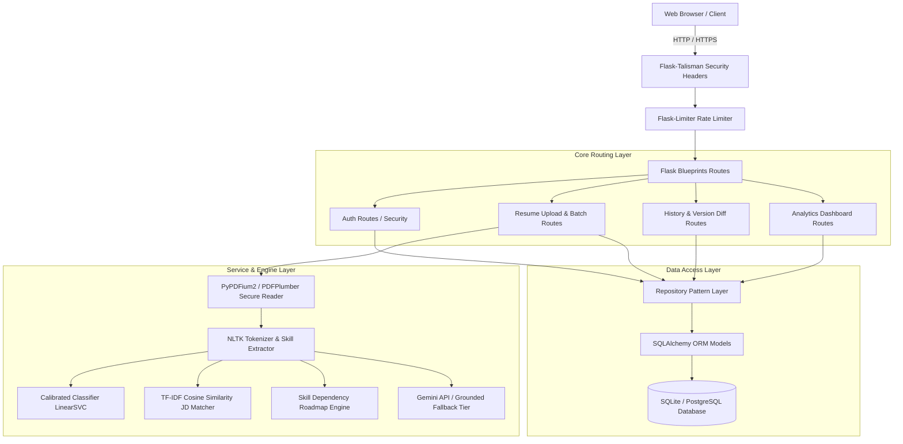

# NLPHire — Enterprise AI Resume Analyzer & Recruitment Automation System

[](https://github.com/InfernoAnant/Resume_Analyzer/actions)
[](https://www.python.org/)
[](https://flask.palletsprojects.com/)
[](https://flask-sqlalchemy.palletsprojects.com/)
[](LICENSE)

An enterprise-grade, full-stack HR-Tech application designed for recruitment automation and ATS resume analysis. Built with Flask, SQLAlchemy, Scikit-Learn, NLTK, and Google Gemini AI, this system automates candidate evaluation, role classification, ATS compatibility scoring, job description semantic matching, personalized learning roadmaps, and recruiter batch candidate ranking.

---

## Technical Architecture Overview



---

## Key Features & System Capabilities

### Security Posture & Hardening
* **Session Fixation Prevention**: Session tokens rotated (`session.clear()`) immediately upon authentication.
* **Account Lockout Protection**: Accounts locked out after 5 consecutive failed password attempts for 15 minutes.
* **Single-Flight Password Reset**: Constant-time `secrets.compare_digest()` token validation with single-use invalidation.
* **Re-Auth Account Deletion**: Account deletion gated by mandatory current password re-authentication.
* **Secure PDF File Handling**: Uploads constrained to non-web-accessible storage (`storage/uploads/`), strictly validated against `%PDF-` magic header bytes, capped at 10MB and 20 pages max.
* **Security Headers**: Enforced via `Flask-Talisman` (CSP, HSTS, X-Frame-Options, X-Content-Type-Options).
* **Structured Logging**: Zero stdout PII logging; structured app logger in [utils/logger.py](file:///c:/Users/ulugu/OneDrive/Desktop/ai-resume-analyzer-main/utils/logger.py).

### Smarter Machine Learning & NLP Engine
* **Calibrated Role Classifier**: `CalibratedClassifierCV` wrapper around `LinearSVC(class_weight='balanced')` delivering genuine, Platt-scaled confidence probabilities.
* **Stratified Held-Out Test Performance**: **99.9% test accuracy** (959 / 960 correct predictions) across 12 engineering roles, with **99.61% 5-fold cross-validation score**.
* **TF-IDF Feature Drivers**: Explains top TF-IDF keywords (`influential_keywords`) driving each role prediction.
* **Synonym Skill Matching**: Canonical skill normalization (`postgres` → `postgresql`, `k8s` → `kubernetes`, `rest apis` → `rest api`).
* **Semantic Document JD Matcher**: Hybrid ATS scoring combining skill token overlap (60%) and TF-IDF Cosine Similarity (40%).

### Advanced Features & Recruiter Tools
* **Resume Version Diffing**: Side-by-side comparison (`/compare/<id1>/<id2>`) showing score delta, added skills, removed skills, and retained skills.
* **Recruiter Batch Ranking Mode**: Multi-resume upload (`POST /batch-analyze`) ranking candidates on a recruiter leaderboard.
* **Resource-Rich Learning Roadmaps**: Dependency-ordered study phases populated with estimated hours, difficulty badges, and official documentation/tutorial links per missing skill.
* **PDF Report Generation**: Downloadable ReportLab PDF summary reports.

---

## Data Layer Architecture

The database layer completely eliminates raw SQL strings in favor of the **Repository Pattern** and **SQLAlchemy ORM**:

* **ORM Models** ([models/models.py](file:///c:/Users/ulugu/OneDrive/Desktop/ai-resume-analyzer-main/models/models.py)): `User`, `Resume`, `RoadmapProgress`, `PasswordResetToken`.
* **Database Repositories** ([models/repository.py](file:///c:/Users/ulugu/OneDrive/Desktop/ai-resume-analyzer-main/models/repository.py)): Dedicated data access classes (`UserRepository`, `ResumeRepository`, `RoadmapRepository`, `TokenRepository`).
* **Database Migrations**: Managed via `Flask-Migrate` & Alembic (`migrations/`).

---

## Machine Learning Pipeline & Metrics

| Metric | Specification |
| :--- | :--- |
| **Model** | `CalibratedClassifierCV(estimator=LinearSVC(class_weight='balanced', random_state=42))` |
| **Vectorization** | `TfidfVectorizer(ngram_range=(1, 3), max_features=20000, sublinear_tf=True)` |
| **Dataset** | 4,800 sample resumes across 12 distinct technical role categories |
| **Test Accuracy** | **99.9%** (959 / 960 correct on held-out test split) |
| **5-Fold CV Accuracy** | **99.61%** |
| **Calibration** | 5-fold Platt scaling for true calibrated probabilities |

---

## REST API Reference

| Endpoint | Method | Auth | Description |
| :--- | :--- | :--- | :--- |
| `POST /register` | POST | Public | Registers a new user account with hashed password |
| `POST /login` | POST | Public | Authenticates user, rotates session, checks lockout |
| `POST /analyze` | POST | User | Uploads single PDF resume with optional role/JD matching |
| `POST /batch-analyze` | POST | User | Uploads multiple candidate PDFs against a JD; returns leaderboard |
| `GET /history` | GET | User | Lists user's historical resume analysis records |
| `GET /compare/<id1>/<id2>` | GET | User | Side-by-side comparison & score delta between 2 resume versions |
| `GET /dashboard` | GET | User | Renders analytics dashboard and role distribution pie chart |
| `POST /delete-account` | POST | User | Permanently deletes account (gated by password re-authentication) |

---

## Local Setup & Quickstart

### Prerequisites
* Python 3.12+
* Git

### Installation
```bash
# 1. Clone the repository
git clone https://github.com/InfernoAnant/Resume_Analyzer.git
cd Resume_Analyzer

# 2. Create virtual environment
python -m venv venv
source venv/bin/activate  # On Windows: venv\Scripts\activate

# 3. Install dependencies
pip install -r requirements.txt

# 4. Download NLTK data resources
python -c "import nltk; nltk.download('punkt'); nltk.download('stopwords')"

# 5. Environment configuration
cp .env.example .env

# 6. Database Migrations
flask db upgrade

# 7. Run Local Dev Server
flask run
```

---

## Running with Docker & Docker Compose

```bash
# Build and launch application container
docker-compose up --build -d

# View logs
docker-compose logs -f web

# Stop container
docker-compose down
```

---

## Running Automated Test Suite

The project includes 20 comprehensive unit and integration tests across 6 dedicated test modules:

```bash
# Run all automated tests in one command
python -m unittest discover tests
```

---

## Project Structure

```text
ai-resume-analyzer-main/
├── app.py                      # Application Factory & Extension Registrations
├── config.py                   # Environment & App Configuration
├── Dockerfile                  # Production Multi-Stage Docker Build
├── docker-compose.yml          # Container Orchestration
├── requirements.txt            # Python Package Dependencies
├── .env.example                # Configuration Blueprint
├── dataset/
│   ├── resume_dataset_v3.csv   # ML Role Training Dataset
│   ├── skills.csv              # Skill Database Taxonomy
│   └── skill_resources.csv     # Learning Resource Database
├── ml_models/
│   ├── train_model.py          # Calibrated Model Training Pipeline
│   ├── resume_classifier.pkl   # Calibrated LinearSVC Model
│   ├── vectorizer.pkl          # TF-IDF Vectorizer Artifact
│   └── confusion_matrix.png    # Evaluation Matrix Heatmap
├── models/
│   ├── models.py               # SQLAlchemy ORM Models
│   ├── repository.py           # Data Repository Access Pattern
│   └── database.py             # Repository Delegation Facade
├── routes/
│   ├── auth_routes.py          # Login, Register, Lockout, Account Deletion
│   ├── resume_routes.py        # PDF Processing, Analysis & Recruiter Batch Mode
│   ├── history_routes.py       # History & Version Comparison Routes
│   └── dashboard_routes.py     # Analytics & Visualizations
├── services/
│   ├── ats_engine.py           # Hybrid ATS Scoring Engine & Explainability
│   ├── jd_matcher.py           # TF-IDF Cosine Similarity Semantic Matcher
│   ├── roadmap_generator.py    # Resource-Rich Learning Roadmap Engine
│   ├── report_service.py       # ReportLab PDF Export Service
│   └── resume_service.py       # Skills Loader with LRU Cache
├── tests/                      # Consolidated Automated Test Suites
│   ├── test_app_baseline.py
│   ├── test_security_phase1.py
│   ├── test_data_layer_phase2.py
│   ├── test_nlp_ml_phase3.py
│   ├── test_feature_depth_phase4.py
│   └── test_frontend_ux_phase5.py
└── utils/
    ├── ai_feedback.py          # Grounded AI Feedback with TTL Cache
    ├── logger.py               # Structured Application Logger
    ├── pdf_reader.py           # Secure PyPDFium2 Reader
    ├── role_predictor.py       # Calibrated Classifier Predictor & Feature Drivers
    └── skill_extractor.py      # Synonym-Aware Skill Extraction
```

---

## License

This project is licensed under the MIT License — see the [LICENSE](LICENSE) file for details.
